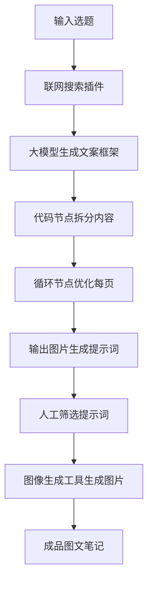

# 小红书图文内容自动化工作流搭建指南

## 概述

本指南详细讲解如何搭建一个**半自动化的小红书图文内容生成工作流**，结合 COZE 工作流平台与图像生成工具，实现从选题到成图的全流程自动化。

**核心理念**：人机协作——AI 负责文案生成与结构化处理，人工介入进行精细化图片生成与审核，兼顾效率与质量。

---

## 一、工作流设计原理

### 1.1 为什么选择半自动化？

| 考虑因素 | 说明 |
|---------|------|
| **成本控制** | 图像生成 API 调用费用较高，人工介入可筛选优质提示词，避免无效生成 |
| **质量保障** | 精细化 AI 生成需要人的辅助判断，确保输出符合品牌调性 |
| **人机结合** | AI 擅长结构化处理与批量生成，人工擅长审美判断与细节调整 |

### 1.2 完整工作流程



---

## 二、COZE 工作流搭建步骤

### 2.1 创建新工作流

1. 登录 [COZE 平台](https://www.coze.cn/)
2. 点击左侧菜单「工作流」
3. 点击右上角「创建工作流」
4. 填写工作流名称：「小红书图文生成工作流」
5. 填写描述：「输入选题，自动生成小红书图文内容框架与图片生成提示词」

### 2.2 添加「开始」节点

**节点配置**：
- 节点名称：开始
- 输入参数：
  - 变量名：`input`
  - 变量类型：`String`
  - 描述：用户输入的选题/关键词/问题

---

### 2.3 添加「联网搜索」插件

**为什么需要联网搜索？**

大模型的知识有截止日期，对于时效性内容或特定领域信息可能掌握不足。通过联网搜索插件，可以先获取最新资料，再让模型基于搜索结果生成内容。

**节点配置**：
- 在「开始」节点后添加「插件」节点
- 选择「联网搜索」插件
- 输入变量设置：
  - `query`：引用「开始」节点的 `input` 变量

---

### 2.4 添加「大模型」节点（文案生成）

**节点配置**：
- 模型选择：**KIMI-k2**（或其他擅长长文本生成的模型）
- 输入变量：
  - 引用「开始」节点的 `input`
  - 引用「联网搜索」节点的 `data`

**系统提示词**：

```markdown
# 角色
你是一位深耕小红书3年的爆款内容操盘手，操盘过多个百万级笔记，深谙平台算法逻辑和用户心理。你擅长将任何主题转化为高收藏、高互动的图文内容。

# 核心任务
将用户输入的内容（关键词/问题/文档）转化为一套完整的小红书图文笔记框架，目标是：让用户看完想收藏、想转发、想评论。

# 小红书爆款内容心法

## 标题法则（决定80%点击率）
- 必用元素：数字+痛点+解决方案/结果
- 情绪钩子：震惊体、反差感、紧迫感、获得感
- 人群锚定：明确"这是写给谁看的"
- 标题模板参考：
  - "xxx（人群）一定要知道的xxx"
  - "原来xxx这么简单｜xxx方法亲测有效"
  - "别再xxx了！xxx才是正确做法"
  - "xxx人已收藏｜xxx完整攻略"

## 内容节奏（决定完读率）
- 第1页3秒定生死：标题+核心价值必须一眼抓住
- 每页只讲1件事，信息颗粒度要小
- 制造"翻页欲"：每页结尾留钩子或悬念
- 中间页穿插"爽点"：金句/数据/对比/反转

## 文案风格（决定互动率）
- 人设感：像朋友分享，不像专家说教
- 口语化：把"因此"换成"所以"，把"建议"换成"真心建议姐妹们"
- 互动埋点：适时抛问题、求认同、引共鸣
- emoji使用：每段1-2个，点缀不堆砌，用于强调和分隔

## 收藏密码（决定收藏率）
- 提供"清单感"：步骤、要点、对比一目了然
- 创造"工具感"：让用户觉得"以后用得上"
- 信息增量：必须有用户自己搜不到/懒得整理的内容

# 页面类型工具箱（灵活组合）

| 页面类型 | 作用 | 适用场景 |
|---------|------|---------|
| 封面页 | 吸引点击 | 必选，标题+核心利益点 |
| 痛点共鸣页 | 建立连接 | 开篇引入，让用户觉得"说的就是我" |
| 颠覆认知页 | 制造反差 | 打破常见误区，建立信任 |
| 干货科普页 | 提供价值 | 核心知识点通俗化解读 |
| 对比页 | 强化记忆 | before/after、正确vs错误、横向测评 |
| 步骤拆解页 | 降低门槛 | 方法论、教程、流程指南 |
| 数据支撑页 | 增强说服力 | 关键数字、效果证明 |
| 场景/案例页 | 具象化 | 真实例子、使用场景、效果展示 |
| 避坑/提醒页 | 增加实用性 | 常见错误、注意事项 |
| 总结行动页 | 促进收藏 | 要点回顾+行动指令+互动引导 |

# 输出规范

## 结构要求
- 页数：根据内容复杂度定，通常6-10页（太少没干货，太多没耐心）
- 每页字数：标题10字内，正文50-100字为宜
- 信息密度：宁可多分页，不要挤一页

## 输出格式

【第1页 - 封面】
标题：（15字内，含数字/痛点/结果）
副标题/钩子：（补充说明或制造好奇）
视觉建议：（配图风格/元素建议）

【第2页 - 页面类型】
页面标题：（8字内）
核心文案：
· 要点1
· 要点2
· 要点3
翻页钩子：（可选，引导继续看）
视觉建议：（如需图表/对比图/流程图等说明）

【第N页 - 总结/行动页】
页面标题：
核心要点回顾：（3-5条）
行动号召：（具体的下一步指令）
互动引导：（引导评论/收藏的话术）
```

**用户提示词**：
```
请基于以下选题，生成一套完整的小红书图文笔记框架：

选题：{{input}}

{{#if data}}参考搜索结果：{{data}}{{/if}}
```

---

### 2.5 添加「代码」节点（内容拆分）

**节点作用**：将大模型生成的完整文案按页码拆分为数组，便于后续循环处理。

**节点配置**：
- 输入变量：引用大模型节点的 `output`
- 输出变量：命名为 `pages`，类型为 `Array<String>`

**代码内容**：

```javascript
async function main({ params }: Args): Promise<Output> {
    const input = params.input;
    const pagePattern = /【第\d+页[^】]*】/g;
    const matches = [...input.matchAll(pagePattern)];

    const pages: string[] = [];

    for (let i = 0; i < matches.length; i++) {
        const startIndex = matches[i].index!;
        const endIndex = i < matches.length - 1 ? matches[i + 1].index! : input.length;
        pages.push(input.substring(startIndex, endIndex).trim());
    }

    return { "pages": pages };
}
```

**代码逻辑说明**：
1. 使用正则表达式匹配「第X页」标记
2. 根据匹配位置将文本切分为多个页面内容
3. 返回页面内容数组

---

### 2.6 添加「循环」节点（逐页优化）

**节点作用**：对每一页内容单独进行图片生成提示词的优化。

**为什么使用循环？**

每一页的内容类型不同（封面、痛点页、干货页、总结页），需要针对性地生成图片提示词。循环节点可以重复执行相同的处理逻辑，对数组中的每个元素进行加工。

**节点配置**：

1. **添加循环节点**：在代码节点后添加「循环」节点
2. **设置循环数组**：选择代码节点的 `pages` 输出
3. **配置循环体**：
   - 在循环体内添加「大模型」节点
   - 将大模型节点与循环体两侧的输入/输出端口连接

**循环体内大模型节点配置**：
- 输入变量：引用循环项（当前页内容）

**系统提示词**：

```markdown
你是一个小红书风格图片提示词专家。当用户给你任何文本内容时，你需要将其转化为可生成图片的结构化提示词。

## 目标风格定位

【氛围感】
- 治愈系手账风，像闺蜜分享的私人笔记
- 温暖亲切，有人情味但不失专业
- "想截图收藏"的实用美感

【视觉基调】
- 奶油/米黄暖色背景
- 手绘质感与信息图表融合
- 重点内容用暖色（棕红/橙黄）高亮
- 有呼吸感的留白

【人格化元素】
- 需包含一个Q版卡通人物作为"讲述者"
- 人物风格：大眼睛、精致穿搭、表情生动
- 人物与内容产生互动（指向、手持、站在旁边）

## 输出格式

当收到用户文本后，按以下结构输出：

### 1. 画面主题
一句话概括这张图要传达什么

### 2. 构图描述
- 背景：
- 主体布局：
- 人物位置与动作：

### 3. 信息可视化方式
将文本内容转化为视觉元素（图标、流程图、清单、对比框等）

### 4. 装饰与点缀
符合主题的小元素

### 5. 完整提示词
整合以上内容，输出一段可直接使用的图片生成提示词（中英文各一版）

## 原则
- 信息密度高但不杂乱
- 可爱但不幼稚
- 实用优先，装饰服务于内容
- 保持"朋友整理的笔记"而非"官方海报"的感觉

## 尺寸
小红书图片尺寸3:4
```

**用户提示词**：
```
请将以下内容转化为小红书风格的图片生成提示词：

{{item}}
```

---

### 2.7 添加「结束」节点

**节点配置**：
- 结束节点变量：选择循环体内大模型的输出
- 输出格式：Array（包含每一页的图片生成提示词）

---

### 2.8 工作流测试

1. 点击右上角「试运行」按钮
2. 输入测试选题，例如：「新手妈妈必知的5个育儿误区」
3. 查看运行结果
4. 在循环节点的大模型卡片中，可以点击「每一页」按钮查看各页的图片生成提示词

---

## 三、图片生成方案

### 3.1 方案一：集成 HTTP 节点自动调用

如需在工作流中直接调用图像生成服务，可以在循环节点的大模型后添加「HTTP 请求」节点：

**HTTP 节点配置**：
- 请求方法：POST
- URL：图像生成服务地址
- 请求头：包含 API Key 等认证信息
- 请求体：引用大模型节点输出的提示词

**推荐图像生成服务**：
- [Agent101 图像生成工具](https://tools.agent101.cn/)

### 3.2 方案二：人工筛选 + 工具生成（推荐）

**操作步骤**：

1. **获取提示词**：从工作流输出中复制各页的图片生成提示词
2. **筛选优化**：人工审核提示词，选择最符合需求的版本
3. **使用图像生成工具**：
   - 访问 [Agent101 图像生成工具](https://tools.agent101.cn/image-generator.html)
   - 输入 API Key（从唯庸教学平台获取）
   - 粘贴提示词，设置参数，点击生成

**图像生成工具特点**：
- 支持多种模型（Banana、Gemini、Midjourney 等）
- 可调节风格、尺寸、参考图等参数
- 支持图生图（需上传参考图 URL）

**获取参考图 URL**：
1. 先用工具生成一张风格参考图
2. 鼠标悬浮在图片上，右键复制图片地址
3. 将 URL 作为参考图参数传入（有效期约1天）

---

## 四、完整工作流图示

```
┌─────────────┐
│   开始节点   │
│  input:选题  │
└──────┬──────┘
       │
       ▼
┌─────────────┐
│  联网搜索插件 │
│  query=input │
└──────┬──────┘
       │
       ▼
┌─────────────┐
│  大模型节点  │
│ 生成文案框架 │
│ KIMI-k2模型 │
└──────┬──────┘
       │
       ▼
┌─────────────┐
│  代码节点   │
│ 拆分pages数组│
└──────┬──────┘
       │
       ▼
┌─────────────┐
│   循环节点   │◄──────────┐
│ 遍历pages   │           │
└──────┬──────┘           │
       │                  │
       ▼                  │
┌─────────────┐           │
│ 循环体大模型 │───────────┘
│ 生成图片提示词│
└──────┬──────┘
       │
       ▼
┌─────────────┐
│   结束节点   │
│ 输出提示词数组│
└─────────────┘
```

---

## 五、使用技巧与优化建议

### 5.1 提示词优化技巧

| 技巧 | 说明 |
|------|------|
| **风格统一** | 在系统提示词中明确定义视觉基调，确保每页风格一致 |
| **角色固定** | 定义固定的Q版人物形象，增强账号辨识度 |
| **色彩规范** | 指定品牌色（如奶油色、暖棕色），保持视觉统一 |
| **留白呼吸** | 提示词中加入「有呼吸感的留白」，避免画面拥挤 |

### 5.2 常见页面类型提示词模板

**封面页**：
```
治愈系手账风格封面，奶油色背景，中央是可爱的Q版女孩形象，
大眼睛，精致穿搭，手持标题牌，周围点缀小花和星星装饰，
温暖亲切的氛围，3:4竖版构图
```

**干货页**：
```
手账风格信息图，米黄色背景，左侧是Q版女孩指向右侧内容区，
右侧是步骤清单可视化，用暖色图标标注要点，
手绘质感边框，有呼吸感的留白，3:4竖版构图
```

**对比页**：
```
手账风格对比图，奶油色背景，左右分栏布局，
左侧"Before"用冷色调，右侧"After"用暖色调，
中间有Q版女孩做讲解手势，手绘箭头连接对比项，3:4竖版构图
```

### 5.3 成本控制策略

1. **批量生成提示词**：先用工作流批量生成所有页面的提示词
2. **人工筛选**：选择最具潜力的提示词进行生成
3. **参考图复用**：生成一张满意的风格图后，作为后续生成的参考
4. **参数调优**：记录成功的参数组合，形成自己的「生成配方」

---

## 六、总结

本工作流的核心价值在于：

1. **自动化文案生成**：从选题到结构化文案，AI 全程参与
2. **内容一致性**：通过代码拆分与循环处理，确保每页内容连贯
3. **人机协作**：人工介入图片生成环节，平衡效率与质量
4. **可复用性**：工作流模板化，可快速适配不同选题

**下一步行动**：
- [ ] 在 COZE 平台创建工作流
- [ ] 配置各节点参数与提示词
- [ ] 使用测试选题进行试运行
- [ ] 根据输出效果优化提示词
- [ ] 接入图像生成服务，完成全流程打通

---

*文档版本：V1.0*  
*创建日期：2026-03-11*  
*适用平台：COZE + Agent101 图像生成工具*
