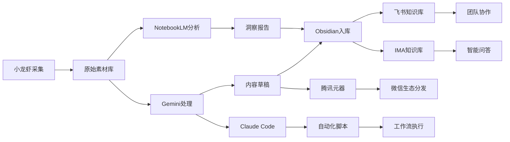

# AI工具整合解决方案
## 个人知识管理与内容创作工作流

---

## 执行摘要

本方案针对Obsidian、Claude Code、Gemini、Gemini智能体、腾讯元器、NotebookLM、IMA、飞书知识库、小龙虾等AI工具，设计一套完整的整合工作流，实现从信息收集、知识管理到内容创作、分发的全链路自动化。

---

## 一、工具定位与功能矩阵

| 工具 | 核心定位 | 主要功能 | 适用场景 |
|:---|:---|:---|:---|
| **Obsidian** | 本地知识中枢 | 双向链接、图谱视图、本地存储 | 个人知识沉淀、笔记管理 |
| **Claude Code** | 代码与复杂任务 | 代码生成、项目开发、深度分析 | 编程、技术实现、复杂推理 |
| **Gemini** | 多模态AI助手 | 长文本处理、多模态理解、搜索增强 | 研究分析、内容生成、问答 |
| **Gemini智能体** | 自动化工作流 | 定时任务、自动触发、批量处理 | 自动化内容生产、定时报告 |
| **腾讯元器** | 中文AI生态 | 微信生态集成、小程序、智能客服 | 微信运营、私域流量、客服 |
| **NotebookLM** | 文档智能分析 | 多文档分析、生成播客、问答 | 文献综述、报告生成、学习 |
| **IMA** | 腾讯知识管理 | 知识库构建、智能问答、协作 | 企业知识管理、团队协作 |
| **飞书知识库** | 团队知识协作 | 文档协作、权限管理、集成办公 | 团队知识共享、项目文档 |
| **小龙虾** | 内容采集工具 | 网页抓取、内容采集、数据获取 | 信息收集、竞品监控、素材采集 |

---

## 二、整合架构设计

### 2.1 整体工作流架构

```
┌─────────────────────────────────────────────────────────────────┐
│                      信息采集层 (Input)                          │
│  小龙虾采集 → 网页内容 → RSS订阅 → 社交媒体 → 竞品监控            │
└─────────────────────────────────────────────────────────────────┘
                              ↓
┌─────────────────────────────────────────────────────────────────┐
│                      知识处理层 (Process)                        │
│  ┌──────────┐  ┌──────────┐  ┌──────────┐  ┌──────────┐        │
│  │ NotebookLM│  │  Gemini  │  │Claude Code│  │  腾讯元器 │        │
│  │ 文档分析  │  │ 内容生成 │  │ 代码实现  │  │ 微信集成 │        │
│  └──────────┘  └──────────┘  └──────────┘  └──────────┘        │
└─────────────────────────────────────────────────────────────────┘
                              ↓
┌─────────────────────────────────────────────────────────────────┐
│                      知识存储层 (Storage)                        │
│  ┌──────────────┐              ┌──────────────┐                │
│  │   Obsidian   │  ←────────→  │  飞书知识库  │                │
│  │  本地知识库   │   双向同步    │  团队知识库   │                │
│  └──────────────┘              └──────────────┘                │
│         ↓                            ↓                         │
│  ┌──────────────┐              ┌──────────────┐                │
│  │     IMA      │              │  Gemini智能体 │                │
│  │  腾讯知识管理 │              │   自动化工作流 │                │
│  └──────────────┘              └──────────────┘                │
└─────────────────────────────────────────────────────────────────┘
                              ↓
┌─────────────────────────────────────────────────────────────────┐
│                      内容输出层 (Output)                         │
│  微信公众号 ← 腾讯元器 │ 小红书/抖音 ← 内容生成 │ 邮件/报告 ← 自动化 │
└─────────────────────────────────────────────────────────────────┘
```

### 2.2 数据流向设计



---

## 三、具体落地方案

### 3.1 方案一：个人知识管理工作流

**目标**：建立从信息收集到知识沉淀的完整闭环

#### 阶段1：信息采集（小龙虾 + RSS）

**工具配置**：
- **小龙虾**：配置采集规则，抓取目标网站、竞品动态、行业资讯
- **RSS订阅**：使用Inoreader或Feedly订阅优质信源
- **浏览器插件**：配置Obsidian Web Clipper快速剪藏

**自动化流程**：
```python
# 伪代码示例
每天定时执行:
    1. 小龙虾抓取新内容 → 保存到"待处理"文件夹
    2. RSS聚合器检查更新 → 提取摘要
    3. 触发Gemini分析 → 生成内容标签和摘要
    4. 推送到Obsidian"每日收件箱"
```

#### 阶段2：知识处理（NotebookLM + Gemini）

**NotebookLM工作流**：
1. 将相关文档批量导入NotebookLM
2. 使用AI生成：
   - 文档摘要
   - 关键洞察
   - 关联分析
   - 播客脚本（可选）
3. 导出分析结果

**Gemini增强处理**：
- 长文本深度分析
- 跨文档知识关联
- 生成思维导图大纲
- 提炼行动要点

#### 阶段3：知识入库（Obsidian）

**Obsidian结构化存储**：
```
知识库结构:
├── 00-Inbox/              # 每日收件箱
├── 01-Projects/           # 项目笔记
├── 02-Areas/              # 领域知识
│   ├── 内容创作/
│   ├── 技术开发/
│   ├── 商业分析/
│   └── 个人成长/
├── 03-Resources/          # 参考资料
│   ├── 文章摘抄/
│   ├── 书籍笔记/
│   └── 视频笔记/
├── 04-Archive/            # 归档
└── 99-Daily/              # 每日日志
```

**标签体系**：
- `#待处理` `#处理中` `#已完成`
- `#重要` `#紧急` `#长期`
- `#技术` `#商业` `#创作` `#学习`
- 时间标签：`#2026-Q1` `#2026-03`

#### 阶段4：知识应用（Claude Code实现）

**自动化脚本开发**：
- 使用Claude Code编写Python脚本
- 实现Obsidian笔记的自动整理
- 生成周/月度知识报告
- 提取待办事项并同步到任务管理工具

### 3.2 方案二：内容创作工作流

**目标**：实现从选题到发布的全自动化内容生产

#### 选题阶段（Gemini智能体）

**自动化选题系统**：
```
定时任务（每日9:00）:
├── 1. Gemini智能体扫描热点
│   └── 分析微博、知乎、小红书热榜
├── 2. 结合历史数据预测趋势
│   └── 调用Obsidian中的历史选题库
├── 3. 生成本周选题清单
│   └── 包含：标题、角度、预期效果
└── 4. 推送到飞书多维表格
    └── 等待人工确认
```

#### 创作阶段（多工具协作）

**内容创作流程**：
| 步骤 | 工具 | 产出 |
|:---|:---|:---|
| 资料收集 | 小龙虾 + NotebookLM | 素材包、参考文档 |
| 大纲生成 | Gemini | 文章结构、章节要点 |
| 初稿撰写 | Claude Code | 完整文章草稿 |
| 配图生成 | Gemini/Stable Diffusion | 封面图、插图 |
| 排版优化 | 飞书文档 | 最终排版稿 |

#### 分发阶段（腾讯元器 + 多平台）

**一键分发系统**：
```
内容完成 → 腾讯元器接管
    ├── 微信公众号排版发布
    ├── 小红书图文生成
    ├── 知乎回答/文章发布
    ├── 微博内容同步
    └── 飞书群通知推送
```

### 3.3 方案三：团队协作工作流

**目标**：建立团队级知识共享与协作体系

#### 知识库架构（飞书 + IMA）

**双轨制设计**：
- **飞书知识库**：对外协作、项目文档、流程规范
- **IMA知识库**：对内知识沉淀、智能问答、经验积累

**同步机制**：
```
Obsidian（个人） ←→ 飞书知识库（团队）
       ↑                    ↑
       └────── IMA ─────────┘
         （腾讯生态整合）
```

#### 智能问答系统（IMA + Gemini）

**企业知识助手**：
1. 将历史文档、FAQ、培训资料导入IMA
2. 配置Gemini作为底层模型
3. 团队成员可通过自然语言查询知识
4. 自动学习新问题，持续优化回答

#### 项目协作（飞书多维表格 + 自动化）

**项目看板自动化**：
- 使用Claude Code开发飞书API脚本
- 实现任务状态自动流转
- 进度报告自动生成
- 风险预警自动推送

---

## 四、技术实现方案

### 4.1 核心自动化脚本

#### 脚本1：Obsidian → 飞书知识库同步

```python
#!/usr/bin/env python3
"""
Obsidian to Feishu Wiki Sync
实现个人笔记到团队知识库的自动同步
"""

import os
import yaml
from datetime import datetime
from feishu_api import FeishuWikiAPI  # 飞书API封装

class ObsidianFeishuSync:
    def __init__(self, vault_path, feishu_token):
        self.vault_path = vault_path
        self.feishu = FeishuWikiAPI(feishu_token)
        self.sync_log = []
    
    def scan_notes(self, tag_filter="#share"):
        """扫描带有分享标签的笔记"""
        notes = []
        for root, dirs, files in os.walk(self.vault_path):
            for file in files:
                if file.endswith('.md'):
                    filepath = os.path.join(root, file)
                    content = open(filepath, 'r', encoding='utf-8').read()
                    
                    # 解析YAML frontmatter
                    if content.startswith('---'):
                        _, fm, body = content.split('---', 2)
                        metadata = yaml.safe_load(fm)
                        
                        if tag_filter in metadata.get('tags', []):
                            notes.append({
                                'path': filepath,
                                'title': metadata.get('title', file[:-3]),
                                'tags': metadata.get('tags', []),
                                'content': body.strip(),
                                'modified': os.path.getmtime(filepath)
                            })
        return notes
    
    def sync_to_feishu(self, notes, target_space):
        """同步到飞书知识库"""
        for note in notes:
            # 转换Markdown为飞书文档格式
            feishu_content = self._convert_md_to_feishu(note['content'])
            
            # 创建或更新文档
            result = self.feishu.create_or_update_doc(
                space_id=target_space,
                title=note['title'],
                content=feishu_content,
                tags=note['tags']
            )
            
            self.sync_log.append({
                'title': note['title'],
                'status': 'success' if result else 'failed',
                'time': datetime.now().isoformat()
            })
    
    def _convert_md_to_feishu(self, md_content):
        """Markdown转飞书文档格式"""
        # 实现转换逻辑
        pass

# 使用示例
if __name__ == "__main__":
    syncer = ObsidianFeishuSync(
        vault_path="/path/to/obsidian/vault",
        feishu_token="your-feishu-token"
    )
    notes = syncer.scan_notes(tag_filter="#team-share")
    syncer.sync_to_feishu(notes, target_space="your-space-id")
```

#### 脚本2：内容自动化发布

```python
#!/usr/bin/env python3
"""
Content Auto-Publish System
一键发布到多个平台
"""

import asyncio
from typing import Dict, List
from dataclasses import dataclass

@dataclass
class ContentPackage:
    title: str
    content: str
    images: List[str]
    tags: List[str]
    platforms: List[str]

class AutoPublisher:
    def __init__(self):
        self.platforms = {
            'wechat': WechatPublisher(),
            'xiaohongshu': XiaohongshuPublisher(),
            'zhihu': ZhihuPublisher(),
            'weibo': WeiboPublisher()
        }
    
    async def publish(self, package: ContentPackage) -> Dict:
        """异步发布到多个平台"""
        results = {}
        tasks = []
        
        for platform in package.platforms:
            if platform in self.platforms:
                publisher = self.platforms[platform]
                # 针对不同平台调整内容格式
                adapted_content = self._adapt_content(package, platform)
                task = publisher.publish(adapted_content)
                tasks.append((platform, task))
        
        # 并发执行
        for platform, task in tasks:
            try:
                result = await task
                results[platform] = {'status': 'success', 'url': result}
            except Exception as e:
                results[platform] = {'status': 'failed', 'error': str(e)}
        
        return results
    
    def _adapt_content(self, package: ContentPackage, platform: str) -> Dict:
        """根据平台特性调整内容"""
        adapters = {
            'wechat': self._adapt_for_wechat,
            'xiaohongshu': self._adapt_for_xhs,
            'zhihu': self._adapt_for_zhihu,
            'weibo': self._adapt_for_weibo
        }
        return adapters.get(platform, lambda x: x)(package)
    
    def _adapt_for_wechat(self, package: ContentPackage) -> Dict:
        """适配微信公众号格式"""
        return {
            'title': package.title,
            'content': self._add_wechat_styling(package.content),
            'cover_image': package.images[0] if package.images else None,
            'summary': package.content[:120] + '...'
        }
    
    def _adapt_for_xhs(self, package: ContentPackage) -> Dict:
        """适配小红书格式"""
        return {
            'title': package.title[:20],  # 小红书标题限制
            'content': package.content + '\n\n' + ' '.join(['#'+t for t in package.tags]),
            'images': package.images[:9]  # 最多9张图
        }

# 使用示例
async def main():
    publisher = AutoPublisher()
    package = ContentPackage(
        title="AI工具整合实战指南",
        content="...",
        images=["cover.png", "img1.png"],
        tags=["AI", "效率工具", "知识管理"],
        platforms=["wechat", "xiaohongshu", "zhihu"]
    )
    results = await publisher.publish(package)
    print(results)

if __name__ == "__main__":
    asyncio.run(main())
```

### 4.2 定时任务配置

#### Gemini智能体工作流配置

```yaml
# gemini_agent_workflows.yaml
workflows:
  daily_content_curation:
    schedule: "0 9 * * *"  # 每天9点
    steps:
      - name: scan_trends
        tool: web_search
        params:
          queries: ["AI最新趋势", "内容创作热点", "效率工具推荐"]
          sources: ["twitter", "reddit", "zhihu", "weibo"]
      
      - name: analyze_content
        model: gemini-2.5-pro
        prompt: |
          分析以下热点内容，识别3个最有价值的选题：
          {{ steps.scan_trends.results }}
          
          输出格式：
          1. 标题：xxx
             角度：xxx
             预期效果：xxx
      
      - name: save_to_feishu
        tool: feishu_bitable
        action: add_records
        table: "内容选题库"
  
  weekly_knowledge_review:
    schedule: "0 18 * * 5"  # 每周五18点
    steps:
      - name: collect_notes
        tool: obsidian_api
        action: query
        filter: "modified:last 7 days"
      
      - name: generate_summary
        model: gemini-2.5-pro
        prompt: |
          总结本周笔记的核心洞察：
          {{ steps.collect_notes.results }}
      
      - name: create_weekly_report
        tool: pdf_generator
        template: "weekly_review"
        output: "Weekly_Review_{{ date }}.pdf"
```

---

## 五、工具选型建议

### 5.1 按使用场景推荐

| 使用场景 | 推荐工具组合 | 理由 |
|:---|:---|:---|
| **个人知识管理** | Obsidian + NotebookLM + Gemini | 本地优先 + AI增强 |
| **内容创作** | Claude Code + Gemini + 腾讯元器 | 代码实现 + 内容生成 + 分发 |
| **团队协作** | 飞书知识库 + IMA + Gemini智能体 | 生态整合 + 智能自动化 |
| **信息监控** | 小龙虾 + Gemini智能体 | 采集 + 自动分析 |
| **技术开发** | Claude Code + Obsidian | 代码实现 + 技术文档 |

### 5.2 成本效益分析

| 工具 | 免费额度 | 付费方案 | 性价比评级 |
|:---|:---|:---|:---:|
| Obsidian | 完全免费 | 可选同步服务$8/月 | ⭐⭐⭐⭐⭐ |
| Claude Code | API按量计费 | $20/月 Pro | ⭐⭐⭐⭐ |
| Gemini |  generous免费额度 | $20/月 Advanced | ⭐⭐⭐⭐⭐ |
| NotebookLM | 完全免费 | 无 | ⭐⭐⭐⭐⭐ |
| 腾讯元器 | 免费额度充足 | 按调用量计费 | ⭐⭐⭐⭐ |
| IMA | 企业版收费 | 咨询销售 | ⭐⭐⭐ |
| 飞书知识库 | 基础版免费 | 企业版收费 | ⭐⭐⭐⭐ |
| 小龙虾 | 免费版有限制 | 订阅制 | ⭐⭐⭐ |

---

## 六、实施路线图

### Phase 1：基础建设（第1-2周）

**Week 1: 工具部署**
- [ ] 安装配置Obsidian，建立基础目录结构
- [ ] 注册配置Gemini API
- [ ] 配置NotebookLM，导入首批文档
- [ ] 安装配置小龙虾采集工具

**Week 2: 流程搭建**
- [ ] 建立Obsidian标签体系和模板
- [ ] 配置NotebookLM分析流程
- [ ] 编写第一批自动化脚本（Claude Code）
- [ ] 测试信息采集→处理→入库全流程

### Phase 2：自动化升级（第3-4周）

**Week 3: 自动化实现**
- [ ] 使用Claude Code开发核心自动化脚本
- [ ] 配置Gemini智能体定时任务
- [ ] 建立Obsidian ↔ 飞书知识库同步机制
- [ ] 测试端到端自动化流程

**Week 4: 集成优化**
- [ ] 集成腾讯元器，实现微信生态打通
- [ ] 配置IMA知识库（如需要）
- [ ] 优化各工具间的数据流转
- [ ] 建立监控和异常处理机制

### Phase 3：规模化应用（第5-8周）

**Week 5-6: 内容工作流**
- [ ] 建立标准化内容创作流程
- [ ] 实现一键多平台分发
- [ ] 建立内容效果追踪机制
- [ ] 优化选题和内容质量

**Week 7-8: 团队协作**
- [ ] 推广团队使用飞书知识库
- [ ] 建立知识共享规范和流程
- [ ] 培训团队成员使用工具链
- [ ] 持续优化和迭代

---

## 七、预期效果与ROI

### 效率提升指标

| 指标 | 当前状态 | 目标状态 | 提升幅度 |
|:---|:---|:---|:---:|
| 信息收集时间 | 2小时/天 | 30分钟/天 | **75%↓** |
| 内容创作时间 | 8小时/篇 | 3小时/篇 | **62%↓** |
| 知识检索时间 | 15分钟/次 | 2分钟/次 | **87%↓** |
| 多平台分发时间 | 2小时/篇 | 10分钟/篇 | **92%↓** |
| 周度报告生成 | 4小时 | 自动完成 | **100%↓** |

### 质量提升指标

- **内容产出量**：预计提升 **3-5倍**
- **知识复用率**：从 <20% 提升至 **>60%**
- **团队协作效率**：提升 **40%**
- **信息遗漏率**：降低 **80%**

---

## 八、风险与对策

| 风险 | 影响 | 对策 |
|:---|:---:|:---|
| API调用成本超支 | 高 | 设置预算上限，使用缓存机制 |
| 数据隐私泄露 | 高 | 敏感数据本地处理，使用端到端加密 |
| 工具服务中断 | 中 | 建立多供应商备份方案 |
| 学习成本过高 | 中 | 分阶段实施，提供培训文档 |
| 自动化失效 | 中 | 建立监控告警，保留人工干预通道 |

---

## 九、附录

### 9.1 推荐学习资源

- **Obsidian**: 官方文档 + 社区插件库
- **Claude Code**: Anthropic官方指南 + GitHub示例
- **Gemini**: Google AI Studio教程
- **NotebookLM**: Google官方教程 + 社区案例
- **腾讯元器**: 腾讯云官方文档

### 9.2 社区与支持

- Obsidian中文社区
- Claude Code Discord
- Gemini API论坛
- 飞书开发者社区

### 9.3 更新日志

| 版本 | 日期 | 更新内容 |
|:---|:---|:---|
| v1.0 | 2026-03-21 | 初始版本，完整工作流设计 |

---

**文档信息**
- 版本：v1.0
- 创建日期：2026-03-21
- 作者：幂档 (mi-dang)
- 状态：待评审
