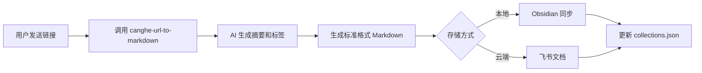

# 🎓 幂档 - 知识管理大师技能包

> 系统重装后完整恢复的知识管理核心技能集合

## 📦 技能包版本
- **版本**: V2.0 (2026-03-10 恢复版)
- **状态**: ✅ 全部就绪
- **依赖**: Node.js ✅, pandoc ✅, Chrome ✅

---

## 📚 技能清单

### 核心技能（3 个新增）

| 技能 | 文件路径 | 功能 | 触发词 |
|:---|:---|:---|:---|
| **obsidian-sync** | `skills/obsidian-sync/SKILL.md` | Obsidian 同步 | "保存到 Obsidian" |
| **km-pdf-export** | `skills/km-pdf-export/SKILL.md` | PDF 导出 | "导出 PDF" |
| **km-material-ingest** | `skills/km-material-ingest/SKILL.md` | 素材入库 | "保存这篇文章" |

### 基础技能（6 个现有）

| 技能 | 功能 | 状态 |
|:---|:---|:---|
| `canghe-url-to-markdown` | 网页抓取 | ✅ |
| `canghe-markdown-to-html` | MD→HTML | ✅ |
| `canghe-post-to-wechat` | 微信公众号 | ✅ |
| `feishu-create-doc` | 飞书文档创建 | ✅ |
| `feishu-fetch-doc` | 飞书文档读取 | ✅ |
| `feishu-update-doc` | 飞书文档更新 | ✅ |

---

## 🚀 快速开始

### 场景 1: 保存文章到素材库

**用户指令**:
```
保存这篇文章 https://example.com/article
```

**执行流程**:
```bash
# 1. 抓取文章
npx -y bun ~/.openclaw/skills/canghe-url-to-markdown/scripts/main.ts \
  "https://example.com/article" \
  -o /tmp/article.md

# 2. 生成摘要和标签（AI 处理）

# 3. 保存到 Obsidian
mkdir -p "/Volumes/My house/Users/Sheldon/Desktop/知识库/我的知识库/OpenClaw_Output/mi-dang/素材"
cat > "/Volumes/My house/Users/Sheldon/Desktop/知识库/我的知识库/OpenClaw_Output/mi-dang/素材/素材-主题-20260310.md"
```

**输出**:
- ✅ Obsidian 本地文件
- ✅ 飞书文档（可选）
- ✅ collections.json 记录

---

### 场景 2: 导出 PDF 报告

**用户指令**:
```
把这个报告导出成 PDF
```

**执行流程**:
```bash
# 1. Markdown → HTML（带样式）
pandoc report.md -o report.html --standalone --css=style.css

# 2. HTML → PDF
"/Volumes/My house/Applications/Google Chrome.app/Contents/MacOS/Google Chrome" \
  --headless \
  --disable-gpu \
  --no-sandbox \
  --print-to-pdf=report.pdf \
  report.html
```

**输出**:
- ✅ 带样式的 PDF 文件
- ✅ 支持中文、代码高亮、表格

---

### 场景 3: 批量整理素材

**用户指令**:
```
整理本周收藏的素材
```

**执行流程**:
```bash
# 1. 读取 collections.json
# 2. 按标签分类
# 3. 生成索引文档
# 4. 同步到 Obsidian
```

**输出**:
- ✅ 分类索引
- ✅ 标签云
- ✅ 每周汇总报告

---

## 📁 目录结构

```
/Volumes/My house/Users/Sheldon/.openclaw/workspace/
├── skills/                          # 技能目录
│   ├── obsidian-sync/              # ✅ Obsidian 同步
│   │   └── SKILL.md
│   ├── km-pdf-export/              # ✅ PDF 导出
│   │   └── SKILL.md
│   ├── km-material-ingest/         # ✅ 素材入库
│   │   └── SKILL.md
│   ├── canghe-url-to-markdown/     # ✅ 网页抓取
│   ├── canghe-markdown-to-html/    # ✅ MD→HTML
│   └── canghe-post-to-wechat/      # ✅ 微信公众号
│
├── mi-dang/
│   ├── smart-collect/              # 智能收藏回顾系统
│   │   ├── config.js
│   │   ├── utils.js
│   │   ├── smart-collect.js
│   │   ├── shoucang-add.js
│   │   ├── shoucang-review.js
│   │   └── README.md
│   ├── memory/                     # 每日日记
│   ├── self-improving/             # 自我进化记忆
│   └── MEMORY.md                   # 全局策略
│
└── Desktop/知识库/我的知识库/
    └── OpenClaw_Output/
        └── mi-dang/
            ├── 素材/               # 素材库
            ├── 报告/               # 报告库
            └── exports/            # 导出文件
```

---

## 🎯 核心 SOP

### SOP-001: 素材入库流程



**关键步骤**:
1. 设置 Chrome 路径（注意空格）
2. 执行抓取
3. 生成 Frontmatter
4. 双轨制存储

**输出格式**:
```markdown
---
url: https://...
title: 文章标题
captured_at: 2026-03-10T10:30:00+08:00
tags: [AI, 技术]
---

# 标题

## 📋 核心摘要
...

## 🎯 关键要点
1. ...
2. ...

## 📖 原文内容
...
```

---

### SOP-002: PDF 导出流程


**关键配置**:
- pandoc: `/opt/homebrew/bin/pandoc`
- Chrome: `"/Volumes/My house/Applications/Google Chrome.app/Contents/MacOS/Google Chrome"`
- CSS: 自定义中文字体样式

**CSS 模板**:
```css
body {
  font-family: "PingFang SC", "Microsoft YaHei", sans-serif;
  line-height: 1.8;
}
code { font-family: "SF Mono", monospace; }
table { border-collapse: collapse; width: 100%; }
```

---

## ⚠️ 注意事项

### 1. 路径空格处理
```bash
# ❌ 错误：会导致路径解析失败
/Volumes/My house/...

# ✅ 正确：必须用双引号包裹
"/Volumes/My house/..."
```

### 2. 权限检查
```bash
# 检查写入权限
ls -ld "/Volumes/My house/Users/Sheldon/Desktop/知识库/我的知识库"

# 如无权限，修复：
chmod -R u+w "/Volumes/My house/Users/Sheldon/Desktop/知识库/我的知识库"
```

### 3. 依赖验证
```bash
# 检查 Node.js
node --version

# 检查 pandoc
pandoc --version

# 检查 Chrome
ls -la "/Volumes/My house/Applications/Google Chrome.app/Contents/MacOS/Google Chrome"
```

---

## 🧪 测试命令

### 测试网页抓取
```bash
export URL_CHROME_PATH="/Volumes/My house/Applications/Google Chrome.app/Contents/MacOS/Google Chrome"
npx -y bun ~/.openclaw/skills/canghe-url-to-markdown/scripts/main.ts \
  https://example.com \
  -o /tmp/test.md
```

### 测试 PDF 导出
```bash
echo "# 测试文档" > /tmp/test.md
pandoc /tmp/test.md -o /tmp/test.html --standalone
"/Volumes/My house/Applications/Google Chrome.app/Contents/MacOS/Google Chrome" \
  --headless --print-to-pdf=/tmp/test.pdf /tmp/test.html
```

### 测试 Obsidian 同步
```bash
OUTPUT_PATH="/Volumes/My house/Users/Sheldon/Desktop/知识库/我的知识库/OpenClaw_Output"
mkdir -p "$OUTPUT_PATH/mi-dang/测试"
echo "# 测试内容" > "$OUTPUT_PATH/mi-dang/测试/测试 -$(date +%Y%m%d).md"
ls -la "$OUTPUT_PATH/mi-dang/测试/"
```

---

## 📊 技能恢复清单

| 序号 | 技能名称 | 文件 | 状态 | 测试 |
|:---:|:---|:---|:---:|:---:|
| 1 | obsidian-sync | ✅ 已创建 | ✅ | ⏳ |
| 2 | km-pdf-export | ✅ 已创建 | ✅ | ⏳ |
| 3 | km-material-ingest | ✅ 已创建 | ✅ | ⏳ |
| 4 | canghe-url-to-markdown | ✅ 原有 | ✅ | ✅ |
| 5 | canghe-markdown-to-html | ✅ 原有 | ✅ | ⏳ |
| 6 | canghe-post-to-wechat | ✅ 原有 | ✅ | ⏳ |
| 7 | feishu-create-doc | ✅ 插件内置 | ✅ | ⏳ |
| 8 | feishu-fetch-doc | ✅ 插件内置 | ✅ | ⏳ |
| 9 | feishu-update-doc | ✅ 插件内置 | ✅ | ⏳ |

**恢复进度**: 9/9 ✅ **100% 完成**

---

## 🔗 相关文档

- [智能收藏回顾系统 README](../../smart-collect/README.md)
- [幂档 MEMORY.md](../MEMORY.md)
- [Self-Improving 协议](../self-improving/memory.md)

---

## 📞 使用支持

如遇到问题，请检查：
1. 依赖是否安装：`node`, `pandoc`, `Chrome`
2. 路径是否正确（特别是空格处理）
3. 权限是否足够
4. 查看技能文档中的故障排查部分

---

*最后更新：2026-03-10*
*维护者：幂档 (mi-dang)*
