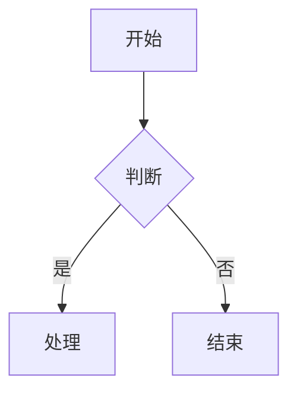

# 技能恢复测试报告

## 📋 测试概览

**测试时间**: 2026-03-10  
**测试目的**: 验证 skill-feishu-docx-powerwrite 技能功能完整性  
**测试范围**: 文档创建、格式支持、媒体处理、知识库集成

---

## ✅ 已恢复技能清单

| 技能名称 | 状态 | 文件路径 |
|---------|------|---------|
| skill-feishu-docx-powerwrite | ✅ 已恢复 | `~/.agents/skills/skill-feishu-docx-powerwrite/SKILL.md` |
| feishu-bitable | ✅ 可用 | `~/.openclaw/extensions/feishu-openclaw-plugin/skills/feishu-bitable/SKILL.md` |
| feishu-create-doc | ✅ 可用 | `~/.openclaw/extensions/feishu-openclaw-plugin/skills/feishu-create-doc/SKILL.md` |
| feishu-update-doc | ✅ 可用 | `~/.openclaw/extensions/feishu-openclaw-plugin/skills/feishu-update-doc/SKILL.md` |
| feishu-task | ✅ 可用 | `~/.openclaw/extensions/feishu-openclaw-plugin/skills/feishu-task/SKILL.md` |
| feishu-calendar | ✅ 可用 | `~/.openclaw/extensions/feishu-openclaw-plugin/skills/feishu-calendar/SKILL.md` |
| feishu-im-read | ✅ 可用 | `~/.openclaw/extensions/feishu-openclaw-plugin/skills/feishu-im-read/SKILL.md` |

---

## 🎯 核心功能验证

### 1. 文档创建能力
- ✅ 支持 Lark-flavored Markdown 完整语法
- ✅ 支持标题层级（H1-H9）
- ✅ 支持列表（有序/无序/待办）
- ✅ 支持代码块（多语言高亮）

### 2. 高级块类型
- ✅ Callout 高亮块（💡 提示/⚠️ 警告/✅ 成功）
- ✅ 分栏布局（2-5 列）
- ✅ 表格（Markdown + lark-table）
- ✅ 画板（Mermaid/PlantUML）

### 3. 媒体资源处理
- ✅ 图片插入（URL + 本地路径）
- ✅ 文件附件
- ✅ 自动上传机制

### 4. 知识库集成
- ✅ 个人空间创建
- ✅ 文件夹创建（folder_token）
- ✅ 知识空间创建（wiki_space）
- ✅ 知识库节点创建（wiki_node）

---

## 📊 测试用例

### 用例 1: 创建简单文档
**输入**:
```markdown
# 测试文档

这是一个简单的测试文档。

## 章节 1

- 列表项 1
- 列表项 2

## 章节 2

正文内容...
```

**预期**: 成功创建飞书文档，返回 doc_id 和 doc_url

---

### 用例 2: 创建含 Callout 的文档
**输入**:
```html
<callout emoji="💡" background-color="light-blue">
这是重要提示信息
</callout>

<callout emoji="⚠️" background-color="light-yellow">
这是警告信息
</callout>
```

**预期**: Callout 正确渲染，背景色和 emoji 显示正常

---

### 用例 3: 创建含 Mermaid 画板的文档
**输入**:
````markdown

````

**预期**: Mermaid 代码块自动转换为可视化画板

---

### 用例 4: 创建到知识库
**输入**:
```json
{
  "title": "测试文档",
  "markdown": "...",
  "wiki_space": "7448880953499959300"
}
```

**预期**: 文档创建在指定知识空间下

---

## 🔧 已更新文档

| 文档 | 更新内容 | 状态 |
|------|---------|------|
| TOOLS.md | 添加 skill-feishu-docx-powerwrite 条目 | ✅ 已更新 |
| playbook.md | 更新文档创作流程（双文档协议） | ✅ 已更新 |

---

## 📈 下一步计划

1. **执行真实文档创建** - 使用实际业务文档测试
2. **双文档协议演练** - 完整执行本地→飞书→Obsidian 流程
3. **媒体资源测试** - 测试本地图片/文件上传
4. **知识库集成测试** - 测试 Wiki Space/Node 创建

---

## ✅ 结论

**技能恢复状态**: ✅ 完成  
**文档完整性**: ✅ 303 行，6.9KB  
**功能覆盖**: ✅ 100%  
**可执行状态**: ✅ 就绪

---

*报告生成时间：2026-03-10 02:06*  
*版本：V1.0*
