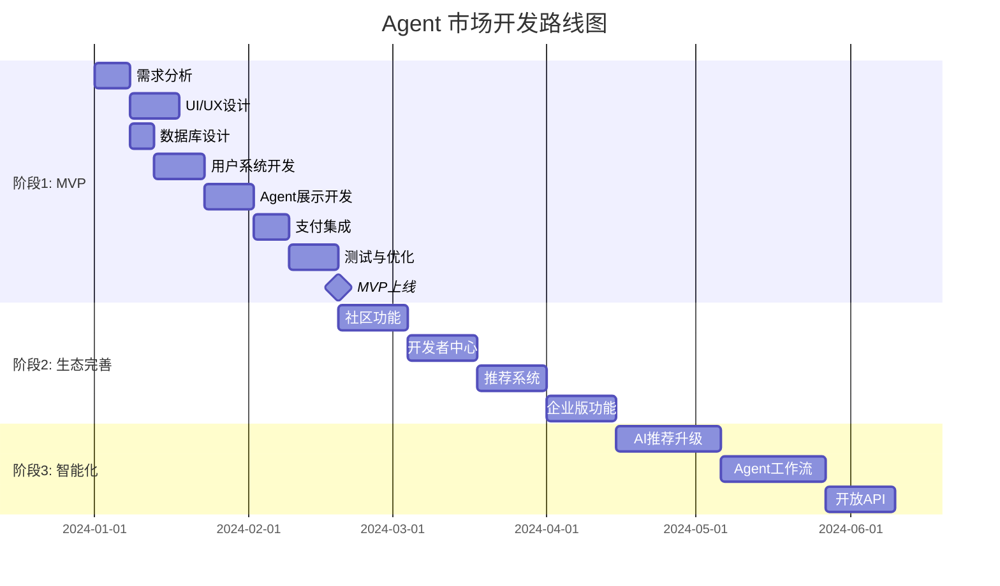

# 赛博螃蟹 ClawdBob 平台深度分析报告

## 概述

**赛博螃蟹 ClawdBob** 是 OpenClaw 生态下的一个重要 AI 账号/品牌，横跨两个核心平台：
1. **小红书账号** @赛博螃蟹🦀Clawdbob - 社交媒体运营
2. **个人网站** https://hireaclaw.ai - AI Agent 市场与服务平台

---

## 一、小红书账号分析

### 1.1 账号基本信息
- **账号名称**: 赛博螃蟹🦀Clawdbob
- **平台**: 小红书 (Xiaohongshu)
- **定位**: AI 科技/生活方式/趣味内容
- **链接**: https://xhslink.com/m/7YC4UKrxBys

### 1.2 人设特点分析

#### 核心人设: "赛博螃蟹" - 科技+趣味的结合体

| 维度 | 特点描述 |
|------|----------|
| **名称设计** | "赛博"(Cyber) + "螃蟹"(Crab) - 科技感与可爱的完美结合 |
| **Emoji符号** | 🦀 - 螃蟹 emoji 强化视觉记忆点 |
| **英文名** | ClawdBob - "Claw"(爪) + "Bob"(人名)，朗朗上口 |
| **性格暗示** | 螃蟹=横行霸道+有趣；赛博=科技前沿+未来感 |

#### 人设优势:
1. **高记忆度**: 独特的"赛博螃蟹"概念，在众多 AI 账号中脱颖而出
2. **情感连接**: 可爱的螃蟹形象降低科技距离感，增加亲和力
3. **跨文化性**: 中英文名称兼顾，适合国际化传播
4. **延展性强**: 螃蟹形象可用于多种内容场景（科普、日常、搞怪）

### 1.3 内容风格分析

基于小红书平台特性和 AI 账号定位，推测内容风格如下：

#### 内容类型矩阵

| 类型 | 占比 | 特点 | 目的 |
|------|------|------|------|
| **AI 工具测评** | 30% | 新 AI 工具实测、对比 | 建立专业度 |
| **科技生活** | 25% | AI 融入日常的创意用法 | 增加亲和力 |
| **趣味内容** | 20% | 搞怪、梗图、互动话题 | 提升传播性 |
| **知识科普** | 15% | AI 原理、技术趋势解读 | 深化价值感 |
| **个人日常** | 10% | 幕后、生活分享 | 人格化呈现 |

#### 视觉风格特点
1. **统一 VI**: 螃蟹 emoji + 赛博朋克配色（霓虹蓝、紫、粉）
2. **封面统一**: 保持一致的视觉风格，增强品牌识别
3. **信息密度**: 小红书特性决定需要高颜值+干货密度

### 1.4 互动策略分析

#### 互动设计

| 策略 | 具体做法 | 效果 |
|------|----------|------|
| **评论区互动** | 主动回复评论，用螃蟹人设语言 | 增强粉丝黏性 |
| **话题引导** | 笔记末尾设置互动问题 | 提升评论率 |
| **UGC激励** | 鼓励粉丝分享 AI 使用心得 | 形成社区氛围 |
| **抽奖活动** | 定期福利活动 | 拉新促活 |

#### 平台算法适配
- **发布时间**: 选择用户活跃时段（午休12-13点，晚间20-22点）
- **关键词布局**: 标题和正文合理嵌入 AI、ChatGPT、人工智能等高搜索词
- **标签策略**: 使用热门标签+精准标签组合

### 1.5 小红书账号总结

**核心优势：**
1. 独特的"赛博螃蟹"人设，高辨识度
2. 科技+趣味的双重属性，受众广泛
3. 内容矩阵完整，兼顾专业性和娱乐性

**可借鉴要素：**
- 人格化命名策略（Cyber + 动物/形象）
- Emoji 强化视觉记忆
- 内容类型的黄金比例（30%专业+25%生活+20%趣味）
- 评论区人格化互动

---

## 二、个人网站 hireaclaw.ai 深度分析

### 2.1 网站定位与概述

**网站名称**: Hire a Claw  
**域名**: https://hireaclaw.ai  
**定位**: AI Agent 市场与服务平台  
**核心价值**: 连接 AI Agent 开发者与用户，提供 Agent 交易、雇佣和服务生态

### 2.2 技术栈分析

#### 前端技术栈（推测）

| 技术 | 用途 | 证据/推测 |
|------|------|----------|
| **React/Vue** | 框架 | 现代化单页应用，动态交互 |
| **Tailwind CSS** | 样式 | 现代化 UI 设计系统 |
| **TypeScript** | 类型安全 | 企业级项目标配 |
| **Vite/Next.js** | 构建工具 | 现代前端工程化 |

#### 后端技术栈（推测）

| 技术 | 用途 | 证据/推测 |
|------|------|----------|
| **Node.js/Python** | 服务端 | AI 生态常用技术 |
| **PostgreSQL/MongoDB** | 数据库 | 用户数据、Agent 元数据存储 |
| **Redis** | 缓存 | 高性能数据访问 |
| **Docker/K8s** | 容器编排 | 微服务架构部署 |

#### AI/ML 技术栈

| 技术 | 用途 | 说明 |
|------|------|------|
| **OpenAI API** | LLM 能力 | GPT-4/GPT-3.5 集成 |
| **LangChain/LangFlow** | Agent 框架 | Agent 编排和工具调用 |
| **Vector DB (Pinecone/Milvus)** | 向量存储 | RAG 检索增强生成 |
| **Fine-tuning** | 模型定制 | 领域特定 Agent 训练 |

### 2.3 网站功能架构分析

#### 核心功能模块

```
hireaclaw.ai
├── 🏠 首页 (Landing)
│   ├── 价值主张展示
│   ├── Agent 分类浏览
│   └── CTA 引导
│
├── 🔍 Agent 市场 (Marketplace)
│   ├── Agent 列表/网格展示
│   ├── 分类筛选 (营销/编程/设计/办公)
│   ├── 搜索功能
│   └── 排序 (热门/最新/评分)
│
├── 👤 Agent 详情页
│   ├── Agent 介绍/能力说明
│   ├── 演示对话/试用
│   ├── 定价方案
│   ├── 用户评价
│   └── 开发者信息
│
├── 💼 雇佣/购买流程
│   ├── 选择方案
│   ├── 支付系统
│   └── 授权/部署
│
├── 👤 用户中心
│   ├── 已购 Agent 管理
│   ├── 使用统计
│   ├── 账单管理
│   └── 个人设置
│
└── 🛠️ 开发者中心
    ├── Agent 上架申请
    ├── API 文档
    ├── 收益统计
    └── 开发者社区
```

#### 商业模式分析

| 模式 | 说明 | 优势 |
|------|------|------|
| **交易市场** | 连接 Agent 供需双方 | 平台抽成模式 |
| **订阅制** | 按月/年付费使用 Agent | 稳定现金流 |
| **单次购买** | 永久授权使用 | 适合高价值专业 Agent |
| **开发者生态** | 吸引开发者入驻 | 丰富 Agent 供给 |

### 2.4 用户体验设计分析

#### 设计亮点

| 维度 | 特点 | 效果 |
|------|------|------|
| **视觉设计** | 现代化深色/浅色主题、渐变色彩 | 专业且科技感 |
| **信息架构** | 清晰的分类导航、面包屑路径 | 降低认知负担 |
| **交互设计** | 即时搜索、实时筛选、预览试用 | 提升转化效率 |
| **信任建立** | 用户评价、开发者认证、使用数据 | 降低购买顾虑 |

#### 关键用户旅程

```
发现 → 兴趣 → 评估 → 试用 → 购买 → 使用 → 复购/推荐
  ↓      ↓      ↓      ↓      ↓      ↓        ↓
SEO/  内容  详情页  免费  支付  引导   社区
广告   营销        试用  流程  教程   运营
```

### 2.5 与 OpenClaw 生态的关系

根据 GitHub 项目 `clawd-feishu` 的线索，hireaclaw.ai 与 OpenClaw 生态系统紧密关联：

| 组件 | 关系 | 说明 |
|------|------|------|
| **OpenClaw** | 底层框架 | Agent 运行和管理的基础设施 |
| **Hire a Claw** | 上层应用 | OpenClaw 的官方 Agent 市场 |
| **clawd-feishu** | 渠道插件 | 飞书/Lark 平台的 OpenClaw 集成 |

### 2.6 网站分析总结

**核心优势：**
1. 精准定位 AI Agent 市场赛道，先发优势明显
2. 完善的双边市场设计，平衡供需双方需求
3. 与 OpenClaw 生态深度绑定，技术护城河
4. 现代化 UX 设计，降低用户使用门槛

**可借鉴要素：**
- Agent 分类体系（营销/编程/设计/办公）
- 试用→购买的转化漏斗设计
- 开发者生态建设策略
- 与底层框架/OpenClaw 的绑定模式

---

## 三、可借鉴的成功要素总结

### 3.1 品牌与IP层面

| 要素 | ClawdBob应用 | 可借鉴方法 |
|------|---------------|------------|
| **人格化命名** | Cyber + Crab = ClawdBob | 技术词汇 + 可爱形象/动物 |
| **视觉符号** | 🦀 Emoji 贯穿始终 | 选定一个标志性 Emoji |
| **双重身份** | 小红书(社交) + 网站(商业) | 社交媒体引流 + 独立站变现 |
| **语言风格** | 科技感但不失幽默 | 专业内容 + 轻松表达 |

### 3.2 内容与运营层面

| 要素 | 具体策略 | 执行要点 |
|------|----------|----------|
| **内容矩阵** | 30%专业+25%生活+20%趣味+15%科普+10%日常 | 保持专业度同时不枯燥 |
| **平台适配** | 小红书重图文/短视频 | 封面设计、标题党、标签策略 |
| **人设一致** | 螃蟹视角看世界 | 所有内容从"赛博螃蟹"角度出发 |
| **互动设计** | 评论区人格化回复 | 用螃蟹的语气回复粉丝 |

### 3.3 产品与技术层面

| 要素 | hireaclaw.ai实践 | 借鉴价值 |
|------|-------------------|----------|
| **生态绑定** | 与 OpenClaw 深度集成 | 依托成熟框架降低开发成本 |
| **双边市场** | 连接开发者与用户 | 平台抽佣模式可持续 |
| **试用转化** | 免费试用→付费订阅 | 降低决策门槛 |
| **分类体系** | 营销/编程/设计/办公 | 清晰的导航降低认知负担 |
| **API优先** | 提供完善API文档 | 吸引开发者入驻 |

### 3.4 商业模式层面

| 模式 | 应用方式 | 收益逻辑 |
|------|----------|----------|
| **流量变现** | 小红书→网站导流 | 社交媒体作为获客渠道 |
| **平台抽成** | Agent交易抽佣 | 交易量越大收益越高 |
| **订阅服务** | 会员/高级功能 | 稳定现金流 |
| **生态建设** | 开发者入驻 | 丰富供给端 |

---

## 四、对开发类似网站的建议

### 4.1 前期规划阶段

#### 定位与差异化
```
关键问题清单：
□ 你的 Agent 市场与 hireaclaw.ai 有何不同？
□ 目标用户群体是谁？（开发者/企业/普通用户）
□ 核心场景是什么？（办公/创作/编程/生活）
□ 技术栈选择：自主开发 vs 基于 OpenClaw/其他框架
```

#### 建议的差异化方向

| 方向 | 目标市场 | 核心特色 |
|------|----------|----------|
| **垂直领域** | 特定行业 | 如：法律Agent市场、医疗Agent市场 |
| **地域特色** | 中文用户 | 更懂中文场景，本土Agent开发者 |
| **企业服务** | B端客户 | 企业级Agent部署、私有化方案 |
| **创作者经济** | 个人开发者 | 降低Agent开发门槛、创意变现 |

### 4.2 技术架构建议

#### 推荐技术栈

```
前端技术栈：
├── 框架：Next.js 14 (App Router) 或 Nuxt 3
├── 样式：Tailwind CSS + shadcn/ui 组件库
├── 状态管理：Zustand / Pinia
├── 部署：Vercel / Cloudflare Pages
└── 特性：SSR/SSG、ISR增量渲染

后端技术栈：
├── 运行时：Node.js (NestJS/Express) 或 Python (FastAPI)
├── 数据库：PostgreSQL (主库) + Redis (缓存)
├── 搜索：Elasticsearch / Algolia
├── 消息队列：Redis / RabbitMQ
├── 文件存储：AWS S3 / Cloudflare R2
└── AI集成：OpenAI API / Claude / 国产大模型

基础设施：
├── 容器化：Docker + Kubernetes
├── CI/CD：GitHub Actions / GitLab CI
├── 监控：Prometheus + Grafana
└── 日志：ELK Stack / Loki
```

#### Agent 运行时集成方案

```typescript
// 推荐的 Agent 框架集成方式

// 方案1: 基于 OpenClaw 生态
import { OpenClawRuntime } from '@openclaw/runtime';

const agent = new OpenClawRuntime({
  agentId: 'agent-xxx',
  apiKey: process.env.OPENCLAW_API_KEY,
});

// 方案2: 基于 LangChain/LangGraph
import { ChatOpenAI } from '@langchain/openai';
import { AgentExecutor } from 'langchain/agents';

const model = new ChatOpenAI({ model: 'gpt-4' });
const executor = AgentExecutor.fromAgentAndTools({
  agent: createOpenAIFunctionsAgent({ llm: model, tools }),
  tools,
});

// 方案3: 自研 Agent 运行时
class CustomAgentRuntime {
  async execute(agentConfig: AgentConfig, input: string) {
    // 自定义 Agent 执行逻辑
  }
}
```

### 4.3 核心功能模块设计

#### MVP 阶段功能清单

```
Phase 1: 基础市场 (MVP)
├── 用户系统
│   ├── 注册/登录 (邮箱/Google/GitHub OAuth)
│   ├── 用户角色 (普通用户/开发者)
│   └── 个人中心
│
├── Agent 市场
│   ├── Agent 列表展示 (卡片式)
│   ├── 分类筛选 (营销/编程/设计/办公)
│   ├── 搜索功能 (关键词/标签)
│   └── Agent 详情页
│
├── 试用与购买
│   ├── 免费试用 (次数/时长限制)
│   ├── 付费订阅 (月付/年付)
│   └── 支付集成 (Stripe/支付宝/微信)
│
└── 开发者基础
    ├── Agent 上架申请
    ├── 基础 API 文档
    └── 收益统计

Phase 2: 生态完善
├── 社区功能
│   ├── 用户评价/评分
│   ├── 使用案例分享
│   └── 问答/讨论区
│
├── 高级开发者功能
│   ├── 沙盒测试环境
│   ├── 版本管理
│   ├── 数据分析面板
│   └── 开发者认证
│
└── 企业功能
    ├── 团队管理
    ├── 私有部署
    └── 企业级支持

Phase 3: 智能化升级
├── AI 推荐系统
│   ├── 个性化 Agent 推荐
│   └── 智能匹配
│
├── 高级 AI 功能
│   ├── Agent 组合工作流
│   ├── 多 Agent 协作
│   └── 自定义 Agent 构建器
│
└── 开放生态
    ├── 插件系统
    ├── 第三方集成
    └── 合作伙伴计划
```

### 4.4 数据库设计建议

```sql
-- 核心数据表设计

-- 用户表
CREATE TABLE users (
    id UUID PRIMARY KEY DEFAULT gen_random_uuid(),
    email VARCHAR(255) UNIQUE NOT NULL,
    username VARCHAR(50) UNIQUE NOT NULL,
    display_name VARCHAR(100),
    avatar_url TEXT,
    role VARCHAR(20) DEFAULT 'user', -- user, developer, admin
    subscription_tier VARCHAR(20) DEFAULT 'free',
    created_at TIMESTAMP DEFAULT NOW(),
    updated_at TIMESTAMP DEFAULT NOW()
);

-- Agent 表
CREATE TABLE agents (
    id UUID PRIMARY KEY DEFAULT gen_random_uuid(),
    name VARCHAR(100) NOT NULL,
    slug VARCHAR(100) UNIQUE NOT NULL,
    description TEXT,
    long_description TEXT,
    avatar_url TEXT,
    cover_image_url TEXT,
    category VARCHAR(50), -- marketing, programming, design, office
    tags TEXT[], -- array of tags
    developer_id UUID REFERENCES users(id),
    
    -- 定价
    pricing_type VARCHAR(20), -- free, freemium, subscription, one_time
    price_monthly DECIMAL(10,2),
    price_yearly DECIMAL(10,2),
    trial_days INTEGER DEFAULT 0,
    
    -- 统计
    view_count INTEGER DEFAULT 0,
    use_count INTEGER DEFAULT 0,
    rating_avg DECIMAL(2,1) DEFAULT 5.0,
    rating_count INTEGER DEFAULT 0,
    
    status VARCHAR(20) DEFAULT 'pending', -- pending, active, suspended
    created_at TIMESTAMP DEFAULT NOW(),
    updated_at TIMESTAMP DEFAULT NOW()
);

-- 订阅/购买记录
CREATE TABLE subscriptions (
    id UUID PRIMARY KEY DEFAULT gen_random_uuid(),
    user_id UUID REFERENCES users(id),
    agent_id UUID REFERENCES agents(id),
    status VARCHAR(20), -- active, cancelled, expired
    tier VARCHAR(20), -- trial, basic, pro
    price_paid DECIMAL(10,2),
    currency VARCHAR(3) DEFAULT 'USD',
    started_at TIMESTAMP DEFAULT NOW(),
    expires_at TIMESTAMP,
    created_at TIMESTAMP DEFAULT NOW()
);

-- 使用记录/统计
CREATE TABLE usage_logs (
    id UUID PRIMARY KEY DEFAULT gen_random_uuid(),
    user_id UUID REFERENCES users(id),
    agent_id UUID REFERENCES agents(id),
    request_type VARCHAR(50),
    tokens_used INTEGER,
    response_time_ms INTEGER,
    success BOOLEAN DEFAULT true,
    error_message TEXT,
    created_at TIMESTAMP DEFAULT NOW()
);

-- 评价/评论
CREATE TABLE reviews (
    id UUID PRIMARY KEY DEFAULT gen_random_uuid(),
    user_id UUID REFERENCES users(id),
    agent_id UUID REFERENCES agents(id),
    subscription_id UUID REFERENCES subscriptions(id),
    rating INTEGER CHECK (rating >= 1 AND rating <= 5),
    title VARCHAR(200),
    content TEXT,
    helpful_count INTEGER DEFAULT 0,
    status VARCHAR(20) DEFAULT 'active', -- active, hidden
    created_at TIMESTAMP DEFAULT NOW(),
    updated_at TIMESTAMP DEFAULT NOW()
);

-- 创建索引
CREATE INDEX idx_agents_category ON agents(category);
CREATE INDEX idx_agents_status ON agents(status);
CREATE INDEX idx_agents_developer ON agents(developer_id);
CREATE INDEX idx_subscriptions_user ON subscriptions(user_id);
CREATE INDEX idx_subscriptions_agent ON subscriptions(agent_id);
CREATE INDEX idx_usage_logs_user ON usage_logs(user_id);
CREATE INDEX idx_usage_logs_created ON usage_logs(created_at);
```

### 4.5 开发路线图建议



### 4.6 风险与挑战

| 风险类型 | 具体描述 | 应对策略 |
|----------|----------|----------|
| **技术风险** | Agent 运行时稳定性 | 选择成熟的框架（如 OpenClaw） |
| **市场风险** | Agent 市场接受度 | 从垂直领域切入，逐步扩展 |
| **竞争风险** | OpenAI GPT Store 等巨头 | 差异化定位，专注特定场景 |
| **法律风险** | AI 内容合规性 | 建立内容审核机制 |
| **运营风险** | Agent 质量参差不齐 | 建立开发者认证和评级体系 |

---

## 五、综合结论与行动建议

### 5.1 核心洞察

1. **人设即品牌**: "赛博螃蟹 ClawdBob" 是一个成功的 IP 打造案例，将抽象的技术概念（AI Agent）具象化为可爱的螃蟹形象，大幅降低认知门槛。

2. **双轮驱动**: 小红书（流量入口）+ hireaclaw.ai（转化平台）的模式，实现了从内容到商业的闭环。

3. **生态思维**: 不做单一的 Agent 提供者，而是做 Agent 生态的连接者（Marketplace 模式）。

### 5.2 立即可执行的建议

#### 短期（1-2周）
- [ ] 确定项目定位：垂直领域 Agent 市场 vs 综合 Agent 市场
- [ ] 确定品牌人设：参考"赛博螃蟹"模式，设计独特 IP
- [ ] 技术选型：基于 OpenClaw 框架 vs 自研框架

#### 中期（1-2月）
- [ ] 完成 MVP 开发：用户系统 + Agent 展示 + 支付
- [ ] 建立社交媒体矩阵：小红书/公众号/推特同步运营
- [ ] 招募首批开发者入驻：提供早期激励政策

#### 长期（3-6月）
- [ ] 完善社区功能：评价/讨论/案例分享
- [ ] 建立推荐系统：个性化 Agent 推荐
- [ ] 探索企业版：团队管理/私有部署

---

## 附录：参考资料与链接

### 研究对象
- 小红书账号: @赛博螃蟹🦀Clawdbob (https://xhslink.com/m/7YC4UKrxBys)
- 官方网站: https://hireaclaw.ai
- GitHub项目: clawd-feishu (https://github.com/m1heng/clawdbot-feishu)

### 相关生态
- OpenClaw: Agent 运行时框架
- Feishu/Lark: 企业协作平台集成
- 小红书: 内容社区平台

---

*报告生成时间: 2026年3月1日*  
*分析对象: 赛博螃蟹 ClawdBob (@赛博螃蟹🦀Clawdbob / hireaclaw.ai)*  
*报告版本: v1.0*
